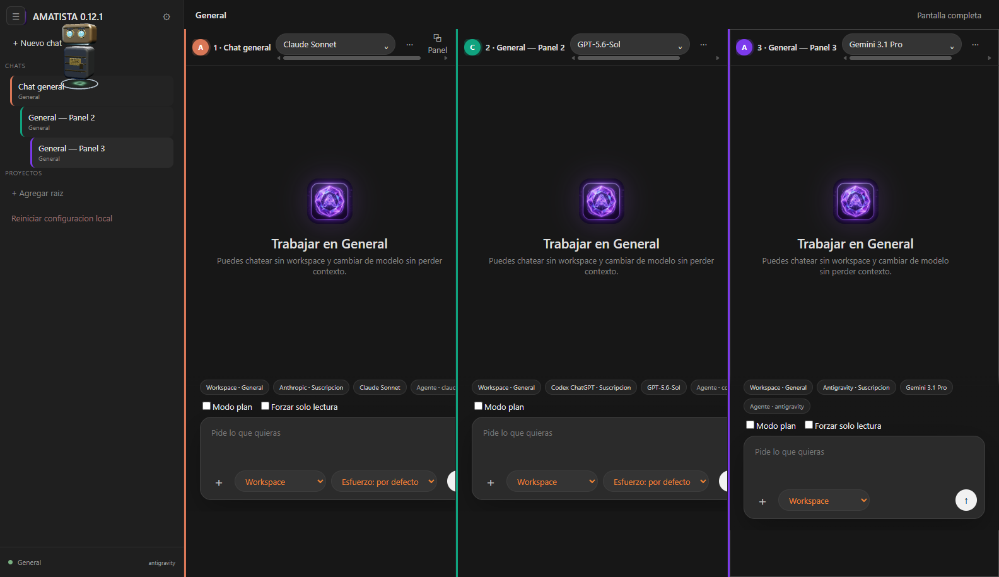

# Amatista

*(nombre de carpeta histórico: `universal-agent-studio`; el producto real, el `productName` de Electron y el nombre usado en todo `docs/_arch/`, es **Amatista**)*

> Amatista nació de un problema práctico — agotar los límites de mis cuentas de IA — y de un sueño más viejo: tener mi propio Jarvis. Con apenas unos meses de programación e IAs, y después de años sin poder sostener este tipo de proyectos por el TDAH, esta es mi forma de entrar a la comunidad, aunque el aporte sea pequeño. La historia completa está en [ORIGEN.md](ORIGEN.md).



**v0.12.3** — estudio de agentes de escritorio (Windows, Electron + React + TypeScript) con múltiples proveedores de modelo intercambiables, paneles de chat en paralelo, un conjunto de herramientas real (filesystem, LSP, git local, terminal, orquestación multi-panel, documentos, imágenes, web, sistema Windows, control de escritorio opcional, navegador embebido) y persistencia local — sin automatización web ni scraping de ningún proveedor.

> Este README describe el estado actual. El historial completo de cada fase/fix, con verificación real y evidencia, vive en `docs/_arch/HISTORY.md`. Los contratos de interfaces/tipos/invariantes vigentes viven en `docs/_arch/CONTRACT.md`. Lo que sigue abierto o descartado explícitamente vive en `docs/_arch/PENDING.md`.

## Proveedores y autenticación

8 tipos de conexión reales (`ProviderType`), más DeepSeek (con endpoint propio compatible con la Anthropic Messages API, publicado oficialmente por DeepSeek — o vía su API nativa OpenAI-compatible, como cualquier conexión `openai-compatible`):

| Proveedor | Auth | Runtime |
|---|---|---|
| OpenAI / Codex (ChatGPT) | suscripción (`codex` CLI ya autenticado) | `codex-subscription` |
| OpenAI (API directa) / OpenAI-compatible | API key, endpoint editable | `openai-chat` (Chat Completions) |
| Anthropic (Claude) | suscripción (`claude` CLI) o API key | `claude-cli` / `anthropic-api` |
| Google (Gemini) | API key | `gemini-api` (HTTP directo — `gemini-cli` standalone fue retirado, Google lo discontinuó para cuentas individuales) |
| Antigravity (Google) | suscripción o API key (mismo binario `agy`) | `antigravity-cli` |
| Microsoft Foundry | API key | `foundry` (Azure OpenAI Responses API) |
| OpenRouter | API key, endpoint editable | `openai-chat` (Chat Completions) |
| DeepSeek | API key — dos caminos reales: el endpoint compatible con la Anthropic Messages API que DeepSeek publica oficialmente (`/anthropic`, pensado para integraciones tipo Claude Code), o su API nativa OpenAI-compatible vía una conexión `openai-compatible` genérica (mismo mecanismo que OpenRouter) | `anthropic-api` (endpoint compatible) / `openai-chat` (API nativa) |

No hay automatización web ni scraping de `chatgpt.com`/`claude.ai`/`gemini.google.com` — la estrategia es siempre reusar flujos oficiales de CLI/sesión o API cuando existen.

## Interfaz — hasta 4 paneles en paralelo

- Hasta 4 `<ChatPanel>` simultáneos, cada uno con su propio chat/workspace/proveedor/modelo, independientes entre sí.
- Árbol de sub-chats (`parentChatId`) con sidebar anidado.
- Presets simples (persona + proveedor/modelo preferido).
- "Modo plan" (liviano y variante reforzada con sandbox read-only real).
- Sandbox por conexión: `read-only` / `workspace-write` / `danger-full-access`.
- Nivel de esfuerzo/razonamiento configurable por turno.
- Mascota Q decorativa (Three.js), arrastrable por toda la ventana — sin lógica de negocio, solo acento visual (color del aro según el proveedor activo).

## Orquestación multi-panel

- `list_windows` / `send_to_window`: un panel puede enviarle un turno completo a otro panel y esperar el resultado.
- `parallel_ask`: fan-out/fan-in real — reparte sub-tareas entre paneles idle ya conectados (nunca abre paneles nuevos), corre en paralelo real entre paneles distintos, en secuencia dentro de un mismo panel; guard de identidad completa (chat/workspace/proveedor/modelo) revalidado justo antes de despachar cada sub-tarea, para que una reconexión durante la aprobación humana no la despache contra un destino distinto del aprobado.
- **Orquestación por suscripción**: `send_to_window`/`parallel_ask` disponibles también como ORIGEN desde paneles conectados por CLI (Claude Code CLI/Antigravity CLI), no solo como destino — vía el mismo servidor MCP propio que ya expone LSP a esos runtimes, con el gate de "panel principal" re-verificado siempre del lado de `main`, nunca confiando en lo que declare el proceso CLI hijo.

## Herramientas del agente

46 tools reales (confirmado por código, `tool-registry.ts`), agrupadas por función:

- **Archivos**: `read_file`, `write_file`, `apply_patch`, `list_dir`, `search_files`, `explore` — con protección TOCTOU real (staleness por hash) contra escrituras concurrentes, incluida la concurrencia genuina que introduce `parallel_ask`.
- **Documentos**: `read_document` — PDF/DOCX/XLSX/HTML, paginado real, con fallback de visión para páginas escaneadas.
- **Código (LSP)**: `get_diagnostics`, `find_definition`, `find_references`, `list_symbols`.
- **Terminal**: `run_command`, `terminal_exec` (terminal persistente por sesión), `git_status`/`git_diff` (atajos de solo lectura equivalentes a `run_command` sobre el `git` real del proyecto, sin diálogo de aprobación).
- **VCS local oculto** (por workspace, un repo `git` propio y separado del `.git` real del proyecto del usuario): `list_file_history`, `revert_file` — cada `write_file`/`apply_patch` queda respaldado automáticamente; cola de ejecución por-repo (una operación lógica completa como unidad atómica, no cada comando `git` suelto) + timeout real.
- **Orquestación**: `list_windows`, `send_to_window`, `parallel_ask`.
- **Multimedia**: `generate_image` (Microsoft Foundry o Gemini/Nano Banana, según la conexión).
- **Web**: `web_search`, `web_fetch` (vía Tavily).
- **Productividad**: `todo_write`, `exit_plan_mode`, `load_skill` (formato Agent Skills, divulgación progresiva).
- **Sistema Windows**: `notify`, `clipboard_get`, `clipboard_set`, `open_url`, `open_folder`, `open_app`, `list_processes`, `system_info`, `volume` — más 3 tools destructivas (`close_app`, `lock_screen`, `power`) con guardia monótona reforzada: piden aprobación explícita SIEMPRE, sin excepción, sin importar el sandbox activo (incluido "Acceso completo") ni una confianza de sesión ya otorgada para otra tool.
- **Control de escritorio** (`screenshot`, `mouse_move`, `mouse_click`, `keyboard_type`) y **navegador embebido** (`browser_navigate`, `browser_click`, `browser_type`, `browser_screenshot`) — ver las 2 secciones dedicadas más abajo.

Todas las llamadas a herramientas MCP y `read_document` tienen timeout real (`guard/`), con higiene de loop por resultado repetido.

## Control de escritorio (computer use)

La feature de mayor riesgo y superficie del proyecto — control real del mouse/teclado y captura de pantalla de la máquina donde corre Amatista, relevante porque la app se entrega públicamente. Apagada por default, con un modelo de seguridad de varias capas independientes:

- **Gate de sesión** (`computerUseActive`): las 4 tools ni siquiera existen para el modelo hasta que el usuario activa el control explícitamente para ese panel — requiere haber reconocido una advertencia dura en Configuración al menos una vez.
- **Aprobación de 2 capas**: además del gate de arriba, cada llamada individual pide aprobación humana incondicional (`requestHardToolApproval()`) — nunca se salta, ni con sandbox "Acceso completo" activo ni con una confianza de sesión ya otorgada para otra tool.
- **Overlay visual** de pantalla completa, visible mientras una acción real está en curso (no solo mientras el control está activado).
- **Panic key global** (`Ctrl+Alt+Shift+Esc`) — cancela el turno completo y desactiva el control de inmediato, sin importar qué panel lo disparó.
- **Cancelación no-cooperativa**: cada movimiento de mouse o tipeo es una secuencia de micro-pasos, chequeados contra cancelación entre cada uno — el panic key o el botón "Detener" interrumpen a mitad de camino, nunca esperan a que termine la acción completa.
- **Resolución primaria por UI Automation, no coordenadas**: un helper propio en C#/.NET (FlaUI), empaquetado como binario self-contained (sin depender de que el usuario tenga el runtime de .NET instalado) junto con la app, resuelve clicks/tipeo por nombre o tipo real de control de Windows — inmune a que una ventana se haya movido entre que el modelo decide el objetivo y la acción corre. Las coordenadas (`x`/`y`) quedan como fallback explícito, para contenido sin semántica real (ej. un canvas de dibujo).

## Navegador embebido

Una `WebContentsView` real por panel (no `BrowserView`, deprecado) — vive dentro del propio panel de chat, aislada con su propio sandbox de Chromium (`contextIsolation`/`sandbox` activos, sin `nodeIntegration`), completamente separada del navegador real del usuario. Interacción primaria por DOM/texto (busca el elemento real por su texto visible o etiqueta, nunca coordenadas de pantalla — inmune a scroll/zoom entre que se calcula el click y se ejecuta); coordenadas quedan como fallback explícito para contenido no-semántico. Mismo modelo de aprobación de 2 capas que el control de escritorio, con un flag de sesión propio e independiente (`browserControlActive`).

## LSP real — 20 lenguajes

Diagnósticos en vivo + navegación por símbolos (`find_definition`/`find_references`/`list_symbols`) sobre servidores LSP reales (no simulados), config-driven (`LANGUAGE_SERVERS`):

TypeScript, JavaScript, Python, Rust, Go, C, C++, Java, YAML, Bash, Terraform, Lua, Dart, Gleam, Clojure, Typst, Zig, Svelte, Astro, Prisma, y Deno (con detección condicional real por `deno.json`, para no colisionar con TypeScript/JavaScript en el mismo workspace).

Vue quedó descartado tal cual está (`@vue/language-server` sin camino real hoy) y Nix quedó descartado sin camino real — ambos documentados en `PENDING.md`, no pendientes de este README.

## MCP

- Cliente MCP real para los runtimes API (lee `.mcp.json`, mergea el catálogo de tools del servidor con el propio).
- Servidor MCP propio de Amatista para exponer LSP a los 3 runtimes CLI (`claude-cli`/`antigravity-cli`/`codex-subscription`), con pre-aprobación de sus 4 tools.

## Persistencia

- Chats persistidos localmente (SQLite), independientes del workspace activo.
- VCS local oculto por workspace — cada escritura real (`write_file`/`apply_patch`) queda respaldada con historial y `revert_file`, sin usar el `.git` real del proyecto del usuario.
- Todo el almacenamiento (datos, cache, cookies) vive centralizado bajo una carpeta de datos propia, configurable en el instalador (con validación de origen: la carpeta de datos no puede ser `$INSTDIR` ni una subcarpeta suya).

## Visión e imágenes

- Visión real en los 4 runtimes API y en los 2 runtimes CLI.
- Generación de imágenes real (`generate_image`) vía Foundry o Gemini/Nano Banana, según la conexión activa.

## Documentación viva

- [`docs/_arch/CONTRACT.md`](docs/_arch/CONTRACT.md) — contratos de interfaces/tipos/invariantes vigentes, con la verificación real de cada fix/feature.
- [`docs/_arch/HISTORY.md`](docs/_arch/HISTORY.md) — bitácora append-only, una entrada por fase/fix.
- [`docs/_arch/PENDING.md`](docs/_arch/PENDING.md) — lo que sigue abierto, descartado explícitamente, o resuelto (con motivo).

## Desarrollo

```powershell
npm install
npm run typecheck
npm run dev
```

## Build / instalador

```powershell
npm run build   # typecheck + electron-vite build + bundle del servidor MCP de LSP
npm run dist    # build + instalador NSIS real (Windows)
```
